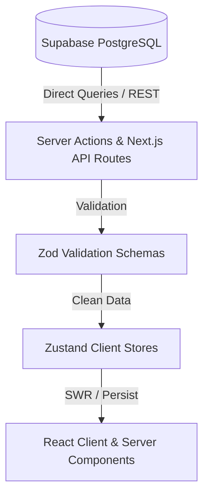

# Flavour & Co. — API & State Architecture Documentation (`API.md`)

This document outlines the API layer, validation schemas, state management flow, and endpoint catalog for the Flavour & Co. web application.

---

## 🏗️ Architecture Data Flow

The application follows a clean 5-tier architecture:

1. **Supabase PostgreSQL**: Single source of truth for all database records (products, blogs, reviews, users, orders, inquiries).
2. **Server Actions & API Layer**: Endpoint handlers located in `src/app/api/` and server-side query utilities in `src/lib/supabase/queries.ts`.
3. **Zod Validation**: Validates all incoming mutation payloads before writing to the database.
4. **Zustand Client Stores**: Shared client state management supporting Stale-While-Revalidate (SWR) background refreshes.
5. **React Components**: Next.js Server Components for static/SEO data fetching, paired with Client Components for interactive UI.

---

## 🛡️ Zod Validation Schemas (`src/lib/validations/`)

All mutation payloads (POST, PUT) are validated using [Zod](https://zod.dev) schemas before reaching the database:

- **[`product.ts`](./src/lib/validations/product.ts)**: Validates product name, category (`freshly-baked`, `frozen`, `grazing-box`), price, pack info, badge tags, description text, and image URLs.
- **[`blog.ts`](./src/lib/validations/blog.ts)**: Validates blog post title, slug, excerpt, content paragraphs array, writer name, category, read time, image URLs, and publish status (**no `authorRole`**).
- **[`review.ts`](./src/lib/validations/review.ts)**: Validates reviewer name, product ID reference, rating (1–5 integer constraint), comment text, and moderation status (`pending`, `approved`, `rejected`).

---

## 🧠 Zustand Stores (`src/store/`)

Zustand is used strictly for **shared client-side state** and **ephemeral UI preferences**, never as the primary server state:

| Store File | Purpose | Persistence Key | Persisted State | SWR / Revalidation Strategy |
| :--- | :--- | :--- | :--- | :--- |
| **`auth.store.ts`** | Manages signed-in user profile & role (`admin` / `customer`). | `flavour_auth_storage` | `userProfile`, `isAuthenticated` | Cleared via `useAuthStore.persist.clearStorage()` on sign-out. |
| **`product.store.ts`** | Shared product catalog, category filters, search query, sorting. | `flavour_product_storage` | `products`, `lastFetchedAt` | Loads instant local cache; background revalidates from `/api/products` if > 5 mins old. |
| **`blog.store.ts`** | Shared blog list, search query, category filter, pagination. | `flavour_blog_storage` | `posts`, `lastFetchedAt` | Loads instant local cache; background revalidates from `/api/blogs` if > 10 mins old. |
| **`ui.store.ts`** | Mobile navigation drawer, search modal, offer modal, toast notifications. | *None (Ephemeral)* | None | Transient UI interactions. |
| **`admin.store.ts`** | Admin dashboard active tab selection, search filter, status filter, date ranges. | *None (Ephemeral)* | None | Transient admin navigation state. |

> **Security Requirement**: Dynamic and sensitive data (orders, purchases, Clerk authentication tokens, payment details, admin permissions) are **NEVER** stored in Zustand local storage. They are always queried live from Supabase or Clerk servers.

---

## 📂 API Routes Catalog (`src/app/api/`)

### 1. Products API
- **`GET /api/products`**: Returns all published products from Supabase formatted into `Product` models.
- **`POST /api/products`**: *(Admin Only)* Creates a new product. Payload validated against `ProductSchema`.
- **`GET /api/products/[id]`**: Fetches a single product by ID.
- **`PUT /api/products/[id]`**: *(Admin Only)* Updates product attributes, pricing, or images.
- **`DELETE /api/products/[id]`**: *(Admin Only)* Deletes a product record from Supabase.

### 2. Blogs API
- **`GET /api/blogs`**: Returns all published blog articles sorted by date.
- **`POST /api/blogs`**: *(Admin Only)* Creates a new blog article. Payload validated against `BlogSchema` (**without `authorRole`**).
- **`GET /api/blogs/[id]`**: Fetches a blog article by ID or slug.
- **`PUT /api/blogs/[id]`**: *(Admin Only)* Updates a blog article or publish status.
- **`DELETE /api/blogs/[id]`**: *(Admin Only)* Deletes a blog article from Supabase.

### 3. Reviews API
- **`GET /api/reviews`**: Queries customer reviews. Accepts optional `productId` and `status` (`approved`, `pending`, `rejected`, `all`) query parameters.
- **`POST /api/reviews`**: Submits a new customer review. Validated against `ReviewSchema`.
- **`PUT /api/reviews`**: *(Admin Only)* Updates review moderation status (`approved` / `rejected`).
- **`DELETE /api/reviews?id=<id>`**: *(Admin Only)* Deletes a review record.

### 4. Authentication & User Sync API
- **`POST /api/auth/sync-user`**: Triggered on Clerk sign-in to synchronize user profiles to the Supabase `users` table and return the formatted `UserProfile`.

### 5. Inquiries, Orders & Dashboard API
- **`GET /api/orders`**: *(Admin Only)* Returns all order transactions from Supabase `orders` table with Square payment IDs, transaction hashes, digital receipt URLs, items breakdown, shipping addresses, and status badges.
- **`PATCH /api/orders`**: *(Admin Only)* Updates order status (`completed`, `processing`, `shipped`, `cancelled`) or fulfillment notes.
- **`POST /api/wholesale`**: Submits commercial wholesale inquiries to `wholesale_inquiries` table.
- **`POST /api/contact`**: Submits customer contact messages to `contact_inquiries` table.
- **`GET /api/dashboard/stats`**: *(Admin Only)* Calculates revenue totals, order counts, user signups, and chart data from Supabase.
- **`POST /api/webhooks/clerk`**: Webhook listener for Clerk user creation, update, and deletion events.

---

## 🔗 Related Documentation
- [Main Project README](./README.md)
- [Database Migration Guide (`MIGRATION.md`)](./MIGRATION.md)
